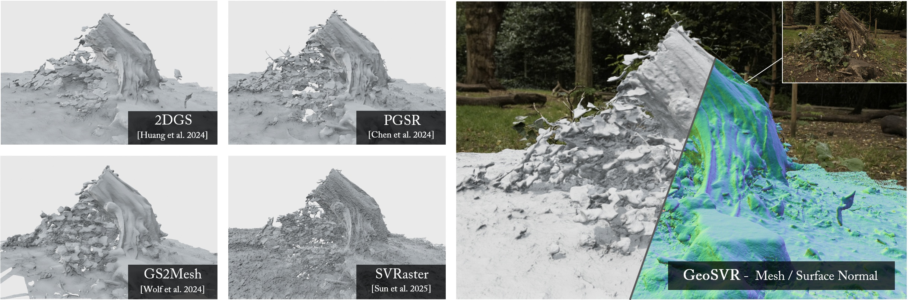

<p align="center">

<h1 align="center">GeoSVR: Taming Sparse Voxels for Geometrically Accurate Surface Reconstruction</h1>
  <p align="center">
    <a href="https://fictionarry.github.io/" target="_blank">Jiahe Li</a>
    ·
    <a href="https://jiaw-z.github.io/" target="_blank">Jiawei Zhang</a>
    ·
    <a href="https://youmi-zym.github.io/" target="_blank">Youmin Zhang</a>
    ·
    <a href="https://scholar.google.com/citations?user=k6l1vZIAAAAJ&hl=en" target="_blank">Xiao Bai</a>
    ·
    <a href="https://openreview.net/profile?id=~Jin_Zheng1" target="_blank">Jin Zheng</a>
    ·
    <a href="https://xiaohanyu-gu.github.io/" target="_blank">Xiaohan Yu</a>
    ·
    <a href="https://sites.google.com/view/linguedu/home" target="_blank">Lin Gu</a>
  </p>

<h2 align="center">NeurIPS 2025 (Spotlight)</h2>

<h3 align="center"><a href="" target="_blank">Paper</a> | <a href="" target="_blank">arXiv</a> | <a href="https://fictionarry.github.io/GeoSVR-project/" target="_blank">Project Page</a>  </h3>
  <div align="center"></div>
</p>

<p align="center">
  <a href="">
    
  </a>
</p>

<p align="center">
Geometric Sparse-Voxel Reconstruction, abbreviated as GeoSVR, delivers high-quality surface reconstruction for intricate real-world scenes based on explicit sparse voxels, with uncertainty quantified depth constraint and voxel surface regularization. It exhibits superiority in the previous rough, inaccurate, or incomplete recovery problems, excelling in delicate details capturing with high completeness and top-tier efficiency.</p>
<br>

<!-- # GeoSVR: Taming Sparse Voxels for Geometrically Accurate Surface Reconstruction


### [Project](https://svraster.github.io) | [Paper](https://svraster.github.io) | [Arxiv](https://arxiv.org/abs/2412.04459) | [Demo Video](./notebooks/)

This is the official repository for our NeurIPS 2025 Spotlight paper **GeoSVR: Taming Sparse Voxels for Geometrically Accurate Surface Reconstruction** -->

## Installation

1. Install the PyTorch environment by `conda env create -f environment.yml` following the reference configuration. Combination of PyTorch 1.13.1 and CUDA 11.7 has been tested. 
2. `pip install ./cuda` for the customized sparse voxel CUDA rasterizer and some utilities.

## Reconstructing Capture

Below go through the workflow for reconstruction from a scene capturing. This process basically follows [SVRaster](https://github.com/NVlabs/svraster) with customized changes.

### Data Preparation

Principlely, this project is compatible with COLMAP format and also NeRF style datasets.  `SIMPLE_PINHOLE` and `PINHOLE` camera model are supported. We recommend following [Gaussian Splatting](https://github.com/graphdeco-inria/gaussian-splatting?tab=readme-ov-file#processing-your-own-scenes) to handle the images captures.

### Scene Optimization

```bash
python train.py --cfg_files $CFG_PATH --source_path $DATA_PATH --model_path $OUTPUT_PATH
```

```bash
python mesh_extract/tsdf_mesh.py $OUTPUT_PATH
```

All the results will be saved into the specified `$OUTPUT_PATH` including the following results:

- `checkpoints/`: Saved checkpoints for the optimization.
- `config.yaml`: The config file for reproduction.
- `mesh/`: Output mesh `tsdf_fusion_post.ply` and the evaluations.
- `pg_view/`: Visualization of the training progress. Useful for debugging.
- `test_stat/`: Some statistic during the training.
- `train/`: Rendered mesh and visualizations from the training set.

The configuration is defined by the following three, obeying SVRaster. The latter overwrites the former.

- `src/config.py`: Define the configuable setup and their initial values.
- `--cfg_files`: Sepcify a list of config files, the later overwrites the former. Some pre-settings are under `cfg/`.
- command line: Any field defined in `src/config.py` can be overwritten through by specifying command line args or flags.

Here we list some important hyperparameters for optimization:

- Depth Constraint
  - `--lambda_depthanythingv2 0.1` to weight the monocular depth constraint from [Depth-Anything-V2](https://github.com/DepthAnything/Depth-Anything-V2).
    - It automatically saves the estimated depth map at the first time this loss is activated for the scene.
    - By default, it uses the implementation of inverse depth loss from SVRaster.
  - `--enable_da2_uncertainty` to enable the voxel-uncertainty depth constraint. 
    - It shall be active only if the former monocular depth is launched. 
  - `--power_level_uncertainty 1.0` as the power number of the uncertainty weight for the depth constraint. 
- Voxel Surface
  - `--multi_view_ncc_weight 0.05 --multi_view_geo_weight 0.01` to use the patch-warping multi-view regularization and PGSR's dual-projection loss.
  - `--voxel_dropout_min 0.5` to specify the minimal remaining sampling rate of the voxel dropout for multi-view regularization.
  - `--lambda_rectify 1e-5` to set the multiplier of the surface rectification regularizer.  Usually lower than 1e-5.
  - `--lambda_scaling_penalty 1e-6` to set the multiplier of the scaling penalty regularizer. Considering a decrease if the textureless background like sky are less focused about. 

For the other unlisted hyperparameter, please refer to [SVRaster](https://github.com/NVlabs/svraster).

### Measuring FPS

```bash
python render.py $OUTPUT_PATH --eval_fps
```

### Rendering Views

- Rendering full training views with visualizations:
  - `python render.py $OUTPUT_PATH --skip_test --use_jpg`
- Rendering reconstructed mesh at training views with open3d:
  - It only works when the mesh file is extracted. 
  - `python render_mesh.py $OUTPUT_PATH`

## Evaluations on Public Dataset

We provide experiment scripts and configurations in `scripts/` and `cfg/` to reproduce the experiments. 

### Download Datasets

We use the preprocessed DTU dataset from [2DGS](https://github.com/hbb1/2d-gaussian-splatting?tab=readme-ov-file#quick-examples), the official Tanks and Temples dataset, and the official Mip-NeRF 360 dataset. Here is the instructions for each.

- [DTU](https://drive.google.com/file/d/1ODiOu72tAGPTnhVn0cFZ9MvymDgcoHxQ/view?usp=drive_link) dataset (2DGS pre-processed)
  - To get the ground-truths, you need also to download the [Points.zip](http://roboimagedata2.compute.dtu.dk/data/MVS/Points.zip) and [SampleSet.zip](http://roboimagedata2.compute.dtu.dk/data/MVS/SampleSet.zip).
- [Tanks and Temples](https://www.tanksandtemples.org/download/) dataset (Official)
  - Ground truth, image set, camera poses, alignment, and cropfiles are required.
  - Following Neuralangelo [instructions](https://github.com/NVlabs/neuralangelo/blob/main/DATA_PROCESSING.md#tanks-and-temples-dataset) to process the scenes with COLMAP.
  - Due to substantial inaccurate estimation existing, we recommend using the 2DGS pre-processed `Courthouse` scene from [here](https://huggingface.co/datasets/ZehaoYu/gaussian-opacity-fields/tree/main) to slightly relieve this problem.
- [Mip-NeRF 360](https://jonbarron.info/mipnerf360/) dataset (Official)

The default dataset organizations under `data/` are like this:

```
TnT
├─ Barn
│  ├─ Barn_COLMAP_SfM.log   (camera poses)
│  ├─ Barn.json             (cropfiles)
│  ├─ Barn.ply              (ground-truth point cloud)
│  ├─ Barn_trans.txt        (colmap-to-ground-truth transformation)
│  ├─ database.db           (colmap generated database)
│  ├─ transforms.json       (generated)
│  ├─ images/               (processed images)
│  └─ images_raw            (raw input images downloaded from Tanks and Temples website)
│     ├─ 000001.png
│     ...
...
DTU                         (official ground truth)
├─ ObsMask/                 (observisibility masks)
└─ Points/                  (stl point clouds)
DTU_2dgs                    (2DGS pre-processed training set)
├─ scan24/
...
360_v2                      (Official Mip-NeRF 360 dataset)
├─ bicycle/
...
```

### Run Evaluation

Following the below examples to reproduce the evaluation on the datasets.

```bash
# We provide three simple workload balance evaluation scripts.
# You may manually select the GPU, and use it as:
# bash scripts/<dataset>_run.sh <output_dir> <max_subsets> <selected_subset> <other_args...>

# Run training on the datasets
bash scripts/dtu_run.sh output/dtu 1 1
bash scripts/tnt_run.sh output/tnt 1 1
bash scripts/mipnerf360_run.sh output/360 1 1

# Summarize results
python scripts/dtu_stat.py output/dtu
python scripts/tnt_stat.py output/tnt
python scripts/mipnerf360_stat.py output/360
```

**Note:** The evaluation scripts have a non-trivial influence on mesh quality measurement. In our project, we use the original [Tanks and Temples toolbox](https://github.com/isl-org/TanksAndTemples/tree/master/python_toolbox/evaluation), and [DTU evaluation script](https://github.com/hbb1/2d-gaussian-splatting/tree/main/scripts/eval_dtu) based on [DTUeval-python](https://github.com/jzhangbs/DTUeval-python). 

For TnT evaluation, you may need to create another environment with `open3d==0.9.0` and fill the path of `/<your_path>/envs/open3d090/bin/python` in `scripts/tnt_run.sh` 

Besides, you may also use the customized TnT evaluation script used in SVRaster, 2DGS, and GOF, which is compatible with the newest open3d and in principle correct, but may produce slightly higher results than the previous.

## Acknowledgement

This method is developed on the excellent open-source projects [svraster](https://github.com/NVlabs/svraster) and [gaussian-splatting](https://github.com/graphdeco-inria/gaussian-splatting). Regularizations are implemented with the help of [Depth-Anything-V2](https://github.com/DepthAnything/Depth-Anything-V2), [DNGaussian](https://github.com/Fictionarry/DNGaussian), [PGSR](https://github.com/zju3dv/PGSR), and [Geo-Neus](https://github.com/GhiXu/Geo-Neus). Readme template is from [svraster](https://github.com/NVlabs/svraster) and [GOF](https://github.com/autonomousvision/gaussian-opacity-fields). Thanks for their great contributions.

------

Please kindly consider citing as below if you find this repository helpful in your project:

```bibTeX
@article{li2025geosvr,
  title={GeoSVR: Taming Sparse Voxels for Geometrically Accurate Surface Reconstruction},
  author={Li, Jiahe and Zhang, Jiawei and Zhang, Youmin and Bai, Xiao and Zheng, Jin and Yu, Xiaohan and Gu, Lin},
  journal={Advances in Neural Information Processing Systems},
  year={2025}
}
```
